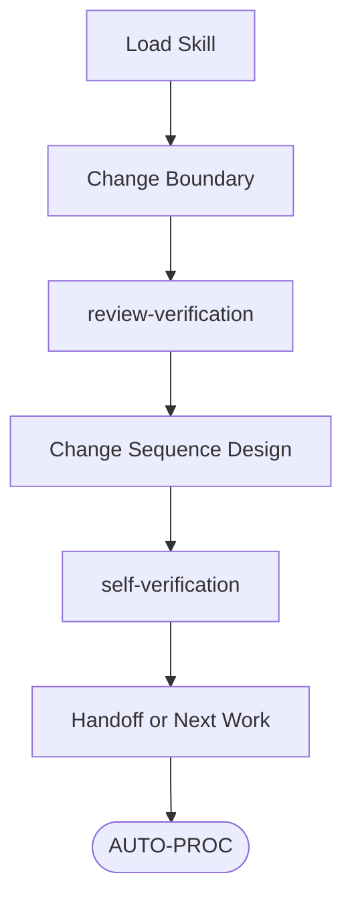

# Flow Overview


# Reference Map
Load only the reference whose trigger is active.
- `.claude/reference/modification-core-law.md`: load for Modification Philosophy keyword gates, preservation rules, source-to-destination continuity, and retroactive current-session handling.
- `.claude/reference/modification-minimal-governance-change-law.md`: load for Patch-Ready Gate, removal-first edit selection, consumed-surface routing, and minimum executable information checks.

# Step 1: Load Skill
Load `Skill(governance-modification)`.

# Step 2: Change Boundary
Freeze change boundary:
- `REQUEST-FIT-BASIS`
- `TARGET-INTENT-BASIS`
- active path/action boundary
- target `.claude` asset or asset set

# Step 3: review-verification
Load `Skill(review-verification)` and call with bounded design question:
- target: Step 2 target asset or asset set
- scope: mode, tier, problem basis, correction direction, consumed target surface, removal-first design, direct-consumption relevance, negative risk, patch-worthiness, patch-readiness, mutation readiness

Consume `review_verification_packet` returned by `Skill(review-verification)` Step 14.
Require `REMOVAL-FIRST-PATCH-DESIGN`, `PATCH-WORTHINESS`, `FINDING-STATE-INVENTORY`, and `NEXT-OWNER-ACTION`.
Reject post-hoc review on already-applied governance patches; route the order failure to recurrence-hardening at the narrowest failed pre-mutation path.

# Step 4: Change Sequence Design
Write `CHANGE-SEQUENCE-DESIGN` only from `review_verification_packet.REMOVAL-FIRST-PATCH-DESIGN`.

Each design item records:
- `PROBLEM-BASIS`
- `CONSUMED-TARGET-SURFACE`
- `EDIT-OPERATION`
- `PRESERVED-MEANING`
- `PRE-MUTATION-BASIS`
- `NEXT-OWNER-ACTION`

Derive `PRE-MUTATION-BASIS` from `.claude/reference/modification-minimal-governance-change-law.md` and `# Patch Execution Method`.
Apply `.claude/CLAUDE.md` `## 5. Modification Philosophy` keyword gate through `.claude/reference/modification-core-law.md`: `removal-first`, `consumed-surface`, `no-compression`, `upper-lower execution-drive`, `executable-imperative`, `minimum-executable-information`.
Keep Step 4 design-only; route file mutation through Step 6.

# Step 5: self-verification
Load `Skill(self-verification)` on the produced `CHANGE-SEQUENCE-DESIGN`.
Call with produced-output kind `governance-asset-change`.
Let `Skill(self-verification)` handle failure, correction packet construction, and repeated correction until convergence or `HOLD`.

# Step 6: Handoff or Next Work
Hand off only self-verified `CHANGE-SEQUENCE-DESIGN` items.
If patch execution is next, execute or hand off through `# Patch Execution Method` with `PRE-MUTATION-BASIS`.
If same-request design rows remain, continue the next row through Step 2.
If a recurrence barrier design converged, carry verified `RESUME-ACTION`.
If the governance design interrupted another procedure path, reopen that path with the verified design basis.
Return converged governance-modification state silently to the calling owner when no same-request executable owner/action remains.

# Patch Execution Method
Use this section to prepare `PRE-MUTATION-BASIS` during Step 4.
Execute patches through this section only after Step 4 design and Step 5 self-verification converge.

## Preconditions
- Current owner/action boundary, `REQUEST-FIT-BASIS`, `TARGET-INTENT-BASIS`, and target `.claude` asset set are recorded.
- `PRE-MUTATION-BASIS` is recorded before mutation and may be prepared from this section during Step 4.
- `Skill(review-verification)` supplied the current mutation-readiness or patch-worthiness basis required by the change tier.
- The patch target is the consumed owner surface that can execute the changed meaning.

## Execution
- Patch from the current live file state; stale baselines, remembered content, and pre-session copies are evidence only.
- Apply only reviewed, bounded, policy-compliant edits.
- Prefer tighten, replace, trim, merge, re-home, or delete before append.
- For moved meaning, record source meaning, destination rationale, changed references, and preserved execution-critical fields.
- For deletion, verify the deleted meaning is duplicate, obsolete, harmful, or preserved on the destination owner surface.
- For recurrence or capability-gap repair, patch the existing consumed surface when it can carry the barrier.
- Create or expand a governance surface only when the review-verified path proves no existing consumed surface can carry the required barrier or reusable capability.
- For blocking hook/settings runtime-enforcement expansion, use Hook-Last review, `.claude/hooks/MANIFEST.md` ledger entry, and explicit operator approval before activation.
- For MCP or external-tool capability changes, preserve official-behavior alignment, capability boundary, fallback, and cleanup truth on the owning environment/runtime surface.

## Post-Verify
- Verify the resulting diff, owner semantics, live references, information preservation, affected consumed surfaces, and in-flight or prior-verdict impact.
- Classify affected current-session surfaces as `unaffected`, `fixed`, `invalidated`, or `deferred per lawful owner-deferral basis`.
- Treat affected prior verdicts, PASS labels, handoffs, or closures as stale until fresh re-verification.
- Keep team-operation continuity through retained carriers, packet fields, consumed owner surfaces, or verification records.
- Reopen `Skill(review-verification)` when post-verification exposes material coherence, owner-surface, negative-risk, removal, or patch-worthiness risk.
- Load `Skill(self-verification)` on the changed-result or resume-action claim before closure, reporting, or handoff.

# Output Format
```
GOVERNANCE-MODIFICATION:
CONVERGENCE-STATE:
```
