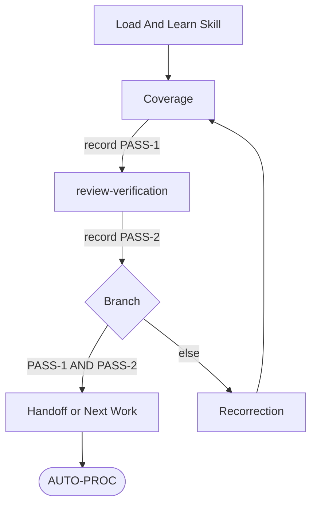

## Structural Contract
- Produce two-pass convergence (`PASS-1` coverage + `PASS-2` review-verification) on a produced work-product surface only; mutation, dispatch, validation, reporting, and calling-owner work remain outside this skill.
- Keep this fixed order after Structural Contract: Flow Overview, Step 1, Step 2, Step 3, Step 4, Step 5, Step 6, Output Format.
- Keep `## Step 1` through `## Step 6` as the canonical step anchors; do not rename or renumber.
- Always run Step 2 (Coverage), Step 3 (review-verification), and Step 4 (Branch) before Step 6 (Handoff).
- Producer-side outbound gate is the default scope; Step 3 Receiver applicability extends the same PASS-2 criteria to receivers evaluating upstream carrier evidence.

## Flow Overview


## Step 1
Load and learn Skill.
PROTECTED-LOCAL-RESTATEMENT-BASIS: skill-activation atomic-check — anti-fabrication tool-invocation rule colocated at every Step 1 invocation moment to defeat carrier-prose substitution at the load decision point. `.claude/reference/work-skill-reference-binding-law.md` `## Skill Rules` defines the general rule; this surface applies it as the Step 1 atomic check at first execution of self-verification.
Load and learn the full `Skill(self-verification)` body via actual `Skill(self-verification)` tool invocation; in-context awareness, prior-session memory, shallow read, or carrier prose asserting "loaded" without same-turn tool invocation and full-body learning does not satisfy this step.
Record the load-and-learn as the same-turn `Skill(self-verification)` tool-call evidence; this evidence is the basis for downstream `PASS-1`/`PASS-2` truth and is required for any later citation that names this load.
Proceed to Step 2.

## Step 2
Coverage.
Select frozen-scope basis (first match wins):
1. `SCOPE-BASELINE` from the active planning record.
2. `COMPLETION-STOP-CONDITION` + `CONCRETE-DELIVERABLE` + frozen request wording.
3. Assignment packet `WORK-SURFACE` + `COMPLETION-STOP-CONDITION` (lane producing owner).
Use the material `TARGET-INTENT-BASIS` from the same active planning or assignment basis when present.

Inventory against frozen scope:
- every requested deliverable surface
- every requested coverage axis
- every material `TARGET-INTENT-BASIS` coverage unit
- every named completion-stop row
- every actually-produced result surface awaiting handoff
- every material returned case, item, finding, fact, count, state label, recommendation, or verdict input awaiting handoff

Map produced surfaces against requested surfaces.
Map produced surfaces against material `TARGET-INTENT-BASIS` coverage units.

Record `PASS-1`:
- `pass` — every request item and every opened closure unit is produced or covered at that unit, with source identity preserved when the surface is an inventory or mapping, and every coverage axis is satisfied.
- `fail` — explicit missing-surface inventory / unmet axis / missing `TARGET-INTENT-BASIS` coverage unit / out-of-scope addition / opened closure unit covered only by category, pattern, theme, wave, batch, priority, summary, count, or work-item abstraction that does not preserve each finer source unit and its next owner/action.

`PASS-1` is a verifiable evidence record citing the actual Step 1 `Skill(self-verification)` tool-call evidence, the consumed frozen-scope basis (which of the 3 selectors fired), the produced-surface inventory mapped against requested surfaces, and the explicit pass/fail verdict. A `PASS-1` claim without these citations is carrier prose, not verified evidence.

Defer produced-result truth, defect, owner boundary, coherence, integrity, and patch-worthiness judgment to Step 3.

Reject sample-only / tier-only / wave-only / representative-slice coverage when frozen scope demands exhaustive; record `fail` with open-surface inventory unless explicit user-narrowed scope or `[USER-DELIVERY-FIT]` lawful deferral.

PROTECTED-LOCAL-RESTATEMENT-BASIS: anti-narrowing operational atomic-check — Anti-Narrowing Law colocated at this skill's coverage-narrowing decision point because narrowing-intent routes through skill-specific `INPUT-COVERAGE-GAPS` + `PASS-1 fail` recorded with frozen-scope 4-tuple; canonical owner is `.claude/reference/review-and-verification-core-law.md` `## Anti-Narrowing Law`.
Anti-narrowing extension (per `.claude/reference/review-and-verification-core-law.md` `## Anti-Narrowing Law`): the sample/tier/wave/representative-slice rejection above is one named negative case under Anti-Narrowing Law.
Additional named negative cases also fail PASS-1: excluding deliverable surfaces from coverage inventory, deferring an opened closure unit to "separate path" without owner direction, scoping-out a finding-class from coverage without owner direction.
Narrowing-intent below frozen-scope basis requires `scope-pressure` to the calling owner with 4-tuple (frozen-scope basis, proposed narrower coverage, narrowing rationale, owner-confirm request); record PASS-1 as `fail` with `INPUT-COVERAGE-GAPS` naming the narrowed-out surface until owner-confirm reply received or explicit owner-confirmed narrower coverage frozen.
Substantive correctness on silently-narrowed coverage does not cure the procedural-adherence defect.

Proceed to Step 3.

## Step 3
review-verification.
Load and learn `Skill(review-verification)` and call with bounded review question:
- target: produced work-product surface, outgoing claim, and every material returned item awaiting handoff.
- question: PASS-2 produced-result verification for the exact target, outgoing claim, corpus, scope, and claim ceiling.
- scope: critical exhaustive inspection of produced-result truth and soundness, evidence fit, defect, coherence, integrity, negative-risk, claim strength, and regression under `Skill(review-verification)` `### 5. Critical Review Gate` defeater-first posture.
- claim ceiling: frozen `CLAIM-CEILING`; review-verification may classify findings, patch-worthiness, handoff disposition, or correction need only within that ceiling.

Consume `review_verification_packet` returned by `Skill(review-verification)` Step 14.
PASS-2 can pass only on a current `review_verification_packet` returned by actual `Skill(review-verification)` load-and-learn and Step 14 execution for the same target, outgoing claim, corpus, scope, and claim ceiling; named-lens scope also requires exact `REVIEW-VERIFICATION-LENSES` and returned lens-relevant fields.
The PASS-2 record cites the packet `WORKFLOW-COVERAGE` value. Treating `lens-bounded` or `gate-only` coverage as `full-steps-1-14` is fabrication.
When the only basis is carrier form, completion fields, PASS wording, checklist text, inline critical-review prose, equivalent checks, or proxy lens mapping, record `PASS-2: fail` and open Step 5 correction.

Target identity for prior-packet reuse: a prior `review_verification_packet` covers the current Step 3 PASS-2 target only when its `REVIEW-TARGET` surface-set fully contains the current Step 3 target's surface-set (produced work-product surface + outgoing claim + every material returned item awaiting handoff).
Partial overlap — where the prior packet covers substantive claim but not carrier-structural integrity, or covers some returned items but not others — does NOT satisfy target identity.
Partial-overlap recovery: the current Step 3 requires either supplementary lens-bounded `Skill(review-verification)` execution (`coherence-integrity-lens` + `procedure-adherence-lens` minimum) producing a fresh packet on the uncovered surface-set, or fresh full-steps-1-14 execution on the current target.
Citing a prior packet whose `REVIEW-TARGET` does not fully contain the current Step 3 target's surface-set is intra-session target-overlap fabrication per `.claude/reference/work-skill-reference-binding-law.md` `## Skill Rules` cross-target ban.

Carrier-as-evidence fabrication is the named failure mode: writing `Skill(self-verification) loaded`, `Skill(review-verification) consumed`, `PASS-1 verified`, `PASS-2 cleared`, or equivalent prose into a carrier without actual same-turn tool invocation evidence is fabrication, not verification.
Producer self-check and receiver evaluation both reject such carriers and route to Step 5.

Citation-evidence fabrication is a parallel failure mode covered by `PASS-2`: when the consumed `review_verification_packet` carries `CITATION-EVIDENCE-INVENTORY` per `Skill(review-verification)` Step 12b Citation Substantiation Gate, PASS-2 also requires every outgoing external citation/anchor claim in the produced packet to have an admissible inventory entry (Class A current-turn tool-call evidence or Class B deferred-Class-A with explicit originating-turn citation per the Gate).
Missing inventory entries, entries lacking the 3-tuple (cited target / freshness class + verifying tool-call / observed verbatim content), or carrier prose marking a citation as Class-A-required without executing the tool-call fail PASS-2 and route to Step 5 with `INPUT-FINDINGS: citation-evidence-fabrication`.

Record `PASS-2`:
- `pass` — Critical Review Gate cleared for produced-result truth and soundness plus outgoing claim under the frozen `CLAIM-CEILING` (material defeaters tested and disproven or owner-deferred) AND `FINDING-STATE-INVENTORY` contains no produced-work-product defect or verification-claim defect that remains `confirmed-defect`, `patch-worthy`, `patch-ready`, or open-candidate blocking the next action.
- `pass` also requires every material returned fact, count, state label, recommendation, verdict input, or other handoff item to be covered by the current `review_verification_packet`, verified retained-carrier feedback, `OPEN-SURFACES`, `scope-pressure`, or `hold|blocker`.
- `fail` — preserve review packet defects and every returned content item or claim lacking exact state, evidence, or coverage. Reject carrier-only, confirmation-only, or convenience-aligned execution; re-call with explicit critical posture against produced content itself.

`PASS-2` is a verifiable evidence record citing the actual `Skill(review-verification)` Step 14 packet identifier or content reference, the consumed `REVIEW-VERIFICATION-LENSES` when named-lens scope, and the explicit pass/fail verdict. A `PASS-2` claim without packet citation is carrier prose, not verified evidence.

Receiver applicability — when self-verification runs on a synthesis or report that incorporates upstream carrier evidence (lane completion, sub-agent output, prior verified result), the carrier evidence quality is part of `PASS-2` truth. Upstream carrier asserting `Skill(...) loaded` or `PASS-N verified` without actual tool invocation evidence fails `PASS-2` for the downstream synthesis even when downstream internal consistency holds. Receiver routes the failure to Step 5 with `INPUT-FINDINGS` naming the upstream carrier defect.

Reject bare `CONFIRMED`; require exact ladder state.

Proceed to Step 4.

## Step 4
Branch.
- `PASS-1: pass` AND `PASS-2: pass` → Step 6.
- Else → Step 5.

## Step 5
Recorrection.
Build correction packet:
- `CORRECTION-TARGETS`: exact surface set to correct
- `INPUT-COVERAGE-GAPS`: Step 2 missing-surface inventory (when present)
- `INPUT-FINDINGS`: Step 3 per-item ladder inventory (when present)
- `PROTECTED-FUNCTION`: rules / procedures / owner-action paths / acceptance surfaces / runtime behaviors that must remain intact

Route by producing owner:
- team-lead lead-local → return correction inventory to team-lead.
- lane -> dispatch via `Skill(task-execution)` assignment-class transport; the visible `SendMessage` body carries one carrier pointer line, and the governed assignment packet carries `MESSAGE-CLASS: assignment` plus `UPSTREAM-DECISION-BASIS: self-verification-correction-cycle`.
- `Skill(governance-modification)` Change Sequence → return correction inventory to that Change Sequence.

Wait for correction completion.
Rerun Step 2 and every downstream step on the corrected surface; prior `PASS-1` and `PASS-2` do not carry over after correction.
Reject partial re-check; require corrected surface + coherence radius.

Proceed to Step 2.

## Step 6
Handoff or Next Work.
Return converged work product silently to calling owner. `PASS-1`, `PASS-2`, recorrection, convergence, report-shape consultation, and handoff-ready status are verification evidence, not visible progress prose.

## Output Format
```
SELF-VERIFICATION:
CONVERGENCE-STATE:
```
