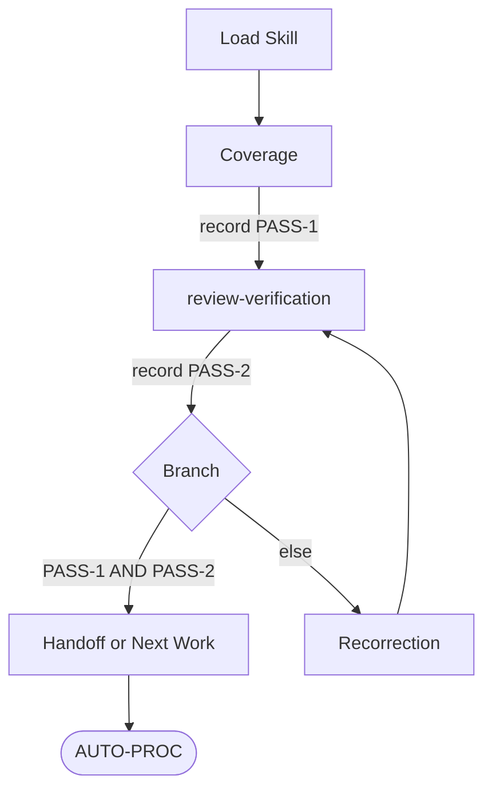

## Flow Overview


## Step 1: Load Skill
Load `Skill(self-verification)`.
Proceed to Step 2.

## Step 2: Coverage
Select frozen-scope basis (first match wins):
1. `SCOPE-BASELINE` from the active planning record.
2. `COMPLETION-STOP-CONDITION` + `CONCRETE-DELIVERABLE` + frozen request wording.
3. Assignment packet `WORK-SURFACE` + `COMPLETION-STOP-CONDITION` (lane producing owner).

Inventory against frozen scope:
- every requested deliverable surface
- every requested coverage axis
- every named completion-stop row
- every actually-produced result surface awaiting handoff

Map produced surfaces against requested surfaces.

Record `PASS-1`:
- `pass` — every request item produced AND every coverage axis satisfied.
- `fail` — explicit missing-surface inventory / unmet axis / out-of-scope addition.

Defer qualitative judgment (defect, design intent, owner boundary, coherence, integrity, patch-worthiness) to Step 3.

Reject sample-only / tier-only / wave-only / representative-slice coverage when frozen scope demands exhaustive; record `fail` with open-surface inventory unless explicit user-narrowed scope or `[USER-DELIVERY-FIT]` lawful deferral.

Proceed to Step 3.

## Step 3: review-verification
Load `Skill(review-verification)` and call with bounded review question:
- target: produced work-product surface set
- produced-output kind: `analysis-claim` | `artifact-change` | `synthesis` | `proof-harness` | `handoff-report` | `governance-asset-change`
- scope: critical exhaustive inspection (defect, coherence, integrity, negative-risk, regression) under `Skill(review-verification)` `### 5. Critical Review Gate` defeater-first posture

Consume `review_verification_packet` returned by `Skill(review-verification)` Step 14.

Record `PASS-2`:
- `pass` — Critical Review Gate cleared (material defeaters tested and disproven or owner-deferred) AND `FINDING-STATE-INVENTORY` carries zero `confirmed-defect`, zero `patch-worthy`, zero `patch-ready`, and no open candidate blocking the next action.
- `fail` — preserve per-item defect inventory from packet. Reject confirmation-only / convenience-aligned execution; re-call with explicit critical posture.

Reject bare `CONFIRMED`; require exact ladder state.

Proceed to Step 4.

## Step 4: Branch
- `PASS-1: pass` AND `PASS-2: pass` → Step 6.
- Else → Step 5.

## Step 5: Recorrection
Build correction packet:
- `CORRECTION-TARGETS`: exact surface set to correct
- `INPUT-COVERAGE-GAPS`: Step 2 missing-surface inventory (when present)
- `INPUT-FINDINGS`: Step 3 per-item ladder inventory (when present)
- `PROTECTED-FUNCTION`: rules / procedures / owner-action paths / acceptance surfaces / runtime behaviors that must remain intact

Route by producing owner:
- team-lead lead-local → return correction inventory to team-lead.
- lane → dispatch via `Skill(task-execution)` with `MESSAGE-CLASS: assignment` and `UPSTREAM-DECISION-BASIS: self-verification-correction-cycle`.
- `Skill(governance-modification)` Change Sequence → return correction inventory to that Change Sequence.

Wait for correction completion.
Reject partial re-check; require corrected surface + coherence radius.

Proceed to Step 3.

## Step 6: Handoff or Next Work
Return converged work product silently to calling owner.

## Output Format
```
SELF-VERIFICATION:
CONVERGENCE-STATE:
```
