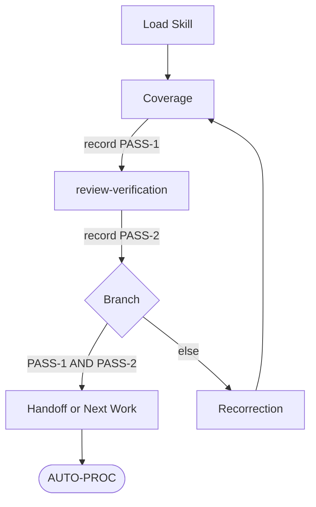

## Structural Contract
- Produce two-pass convergence (`PASS-1` coverage + `PASS-2` review-verification) on a produced work-product surface; do not mutate, dispatch, validate, report, or substitute the calling owner's work.
- Keep this fixed order after Structural Contract: Flow Overview, Step 1, Step 2, Step 3, Step 4, Step 5, Step 6, Output Format.
- Keep `## Step 1` through `## Step 6` as the canonical step anchors; do not rename or renumber.
- Always run Step 2 (Coverage), Step 3 (review-verification), and Step 4 (Branch) before Step 6 (Handoff).
- Producer-side outbound gate is the default scope; Step 3 Receiver applicability extends the same PASS-2 criteria to receivers evaluating upstream carrier evidence.

## Flow Overview


## Step 1: Load Skill
Load and learn the full `Skill(self-verification)` body via actual `Skill(self-verification)` tool invocation; in-context awareness, prior-session memory, or carrier prose asserting "loaded" without same-turn tool invocation does not satisfy this step.
Record the load as the same-turn `Skill(self-verification)` tool-call evidence; this evidence is the basis for downstream `PASS-1`/`PASS-2` truth and is required for any later citation that names this load.
Proceed to Step 2.

## Step 2: Coverage
Select frozen-scope basis (first match wins):
1. `SCOPE-BASELINE` from the active planning record.
2. `COMPLETION-STOP-CONDITION` + `CONCRETE-DELIVERABLE` + frozen request wording.
3. Assignment packet `WORK-SURFACE` + `COMPLETION-STOP-CONDITION` (lane producing owner).
Use the material `TARGET-INTENT-BASIS` from the same active planning or assignment basis when present.

Inventory against frozen scope:
- every requested deliverable surface
- every requested coverage axis
- every material `TARGET-INTENT-BASIS` coverage unit
- every named completion-stop row
- every actually-produced result surface awaiting handoff
- every material returned case, item, finding, fact, count, state label, recommendation, or verdict input awaiting handoff
- every material high-risk judgment claim awaiting handoff per `.claude/reference/review-and-verification-core-law.md` `## Judgment Reliability Law`

Map produced surfaces against requested surfaces.
Map produced surfaces against material `TARGET-INTENT-BASIS` coverage units.

Record `PASS-1`:
- `pass` — every request item and every opened closure unit is produced or covered at that unit, with source identity preserved when the surface is an inventory or mapping, and every coverage axis is satisfied.
- `fail` — explicit missing-surface inventory / unmet axis / missing `TARGET-INTENT-BASIS` coverage unit / out-of-scope addition / opened closure unit covered only by category, pattern, theme, wave, batch, priority, summary, count, or work-item abstraction that does not preserve each finer source unit and its next owner/action.

`PASS-1` is a verifiable evidence record citing the actual Step 1 `Skill(self-verification)` tool-call evidence, the consumed frozen-scope basis (which of the 3 selectors fired), the produced-surface inventory mapped against requested surfaces, and the explicit pass/fail verdict. A `PASS-1` claim without these citations is carrier prose, not verified evidence.

Defer produced-result truth, defect, owner boundary, coherence, integrity, and patch-worthiness judgment to Step 3.

Reject sample-only / tier-only / wave-only / representative-slice coverage when frozen scope demands exhaustive; record `fail` with open-surface inventory unless explicit user-narrowed scope or `[USER-DELIVERY-FIT]` cited lawful owner-deferral authority applies.

Proceed to Step 3.

## Step 3: review-verification
Load and learn the full `Skill(review-verification)` body and call with bounded review question:
- target: produced work-product surface, outgoing claim, and every material returned item awaiting handoff.
- target includes every material high-risk judgment claim awaiting handoff.
- question: PASS-2 produced-result verification for the exact target, outgoing claim, corpus, scope, and claim ceiling.
- scope: critical exhaustive inspection of produced-result truth and soundness, evidence fit, defect, coherence, integrity, negative-risk, claim strength, and regression under `Skill(review-verification)` `### 5. Critical Review Gate` defeater-first posture.
- claim ceiling: frozen `CLAIM-CEILING`; review-verification may classify findings, patch-worthiness, handoff disposition, or correction need only within that ceiling.
PASS-2 review-verification is satisfied only by `Skill(review-verification)` or a current citable `review_verification_packet` meeting this step's reuse rules.
This step does not create a direct `Agent(reviewer)` execution path outside team runtime. When the frozen route or acceptance basis requires an independent reviewer lane, that need is configured-lane work and follows the Work Execution default through `team-lead`, `Skill(task-execution)`, and the team-agent runtime before any `Agent` call.
Only a completion-grade team-runtime carrier can satisfy that lane-owned review; already-returned direct-Agent output from outside team runtime remains fallback evidence only and cannot create PASS-2, independent-lane satisfaction, receipt, reuse, monitoring, or completion handoff.

Consume `review_verification_packet` returned by `Skill(review-verification)` Step 14.
PASS-2 can pass only on a current `review_verification_packet` returned by actual `Skill(review-verification)` load and Step 14 execution for the same target, outgoing claim, corpus, scope, and claim ceiling, or on valid prior-packet reuse that satisfies the rules below; named-lens scope also requires exact `REVIEW-VERIFICATION-LENSES` and returned lens-relevant fields.
Prior `review_verification_packet` reuse is valid only when its `REVIEW-TARGET`, outgoing claim, corpus, scope, claim ceiling, activation freshness, and `WORKFLOW-COVERAGE` fully cover the current PASS-2 target surface set: produced work-product surface, outgoing claim, every material returned item awaiting handoff, and every material high-risk judgment claim awaiting handoff.
Any change to target, outgoing claim, corpus, scope, claim ceiling, bounded question, finding set, patch design, diff, or freshness invalidates reuse and requires a fresh Step 14 packet or a supplementary packet that explicitly covers the changed surface.
Partial target overlap is insufficient.
When a prior packet covers only substantive claims and not carrier structure, outgoing claim, or returned-item coverage, PASS-2 requires a supplementary lens-bounded `Skill(review-verification)` packet using `coherence-integrity-lens` plus `procedure-adherence-lens` at minimum, or a fresh full Steps 1-14 packet on the current target.
The current PASS-2 record cites packet `WORKFLOW-COVERAGE`; treating `lens-bounded` or `gate-only` coverage as `full-steps-1-14` is fabrication.
When the outgoing work product carries external citation or anchor claims, PASS-2 requires the current `review_verification_packet` to contain `CITATION-EVIDENCE-INVENTORY` entries for those claims per `Skill(review-verification)` `### 12b. Citation Substantiation Gate`.
Missing inventory entries, stale entries, incomplete entries, entries lacking target/freshness evidence/observed content, or carrier prose marking a citation as Class-A-required without executing the tool call fail PASS-2 as citation-evidence fabrication.
Route citation-evidence fabrication to Step 5 with `INPUT-FINDINGS: citation-evidence-fabrication`.
When the outgoing work product carries a high-risk judgment, PASS-2 requires the current `review_verification_packet` to contain `JUDGMENT-RELIABILITY` entries for each material high-risk judgment per `Skill(review-verification)` `## Packet` and `.claude/reference/review-and-verification-core-law.md` `## Judgment Reliability Law`.
Missing, stale, contradicted, or open `JUDGMENT-RELIABILITY` entries fail PASS-2 as judgment-reliability gap and route to Step 5.
When the outgoing work product carries governance candidate, defect, rejection, no-patch, patch-worthiness, patch-readiness, enforcement, reporting, transport-defect, malformed-transport, transport-remedy, runtime/tool, hook/settings, or governance-mutation claims, PASS-2 requires the current `review_verification_packet` to contain item-level `CAUSE-REMEDY-CLASSIFICATION` entries for every material behavior-affecting claim per `Skill(review-verification)` `## Packet` and `.claude/reference/review-and-verification-core-law.md` `## Cause And Remedy Classification Law`.
`CAUSE-REMEDY-CLASSIFICATION` entries that are missing, stale, contradicted, open, or fail `.claude/reference/review-and-verification-core-law.md` `## Cause And Remedy Classification Law` required fields fail PASS-2 as cause-remedy-classification gap and route to Step 5.
When the only basis is carrier form, completion fields, PASS wording, checklist text, inline critical-review prose, equivalent checks, or proxy lens mapping, record `PASS-2: fail` and open Step 5 correction.

Carrier-as-evidence fabrication is the named failure mode: writing `Skill(self-verification) loaded`, `Skill(review-verification) consumed`, `PASS-1 verified`, `PASS-2 cleared`, or equivalent prose into a carrier without actual same-turn tool invocation evidence is fabrication, not verification. Producer self-check and receiver evaluation both reject such carriers and route to Step 5.

Record `PASS-2`:
- `pass` — Critical Review Gate cleared for produced-result truth and soundness plus outgoing claim under the frozen `CLAIM-CEILING` (material defeaters tested and disproven or deferred by cited lawful owner-deferral authority) AND `FINDING-STATE-INVENTORY` contains no produced-work-product defect or verification-claim defect that remains `confirmed-defect`, `patch-worthy`, `patch-ready`, or open-candidate blocking the next action.
- `pass` also requires every material returned fact, count, state label, recommendation, verdict input, or other handoff item to be covered by the current `review_verification_packet` or verified retained-carrier feedback. `OPEN-SURFACES`, `scope-pressure`, or `hold|blocker` coverage can pass only for an outgoing open-surface, scope-pressure, or blocked handoff claim; final, completion, or verified-result claims fail while material returned items remain open or blocked.
- `fail` — preserve review packet defects and every returned content item or claim lacking exact state, evidence, or coverage. Reject carrier-only, confirmation-only, or convenience-aligned execution; re-call with explicit critical posture against produced content itself.

`PASS-2` is a verifiable evidence record citing the actual `Skill(review-verification)` Step 14 packet identifier or content reference, the consumed `REVIEW-VERIFICATION-LENSES` when named-lens scope, and the explicit pass/fail verdict. A `PASS-2` claim without packet citation is carrier prose, not verified evidence.

Receiver applicability — when self-verification runs on a synthesis or report that incorporates upstream carrier evidence (team-runtime lane completion, fallback direct-Agent evidence from outside team runtime, or prior verified result), the carrier evidence quality is part of `PASS-2` truth. Fallback direct-Agent evidence from outside team runtime stays bounded evidence only and cannot satisfy team-runtime lane work or independent reviewer/proof/validation routes. Upstream carrier asserting `Skill(...) loaded` or `PASS-N verified` without actual tool invocation evidence fails `PASS-2` for the downstream synthesis even when downstream internal consistency holds. Receiver routes the failure to Step 5 with `INPUT-FINDINGS` naming the upstream carrier defect.

Reject bare `CONFIRMED`; require exact ladder state.

Proceed to Step 4.

## Step 4: Branch
- `PASS-1: pass` AND `PASS-2: pass` → Step 6.
- Else → Step 5.

## Step 5: Recorrection
Build correction packet:
- `CORRECTION-TARGETS`: exact surface set to correct
- `INPUT-COVERAGE-GAPS`: Step 2 missing-surface inventory (when present)
- `INPUT-FINDINGS`: Step 3 per-item ladder inventory (when present)
- `PROTECTED-FUNCTION`: rules / procedures / owner-action paths / acceptance surfaces / runtime behaviors that must remain intact

Route by producing owner:
- team-lead lead-local → return correction inventory to team-lead.
- lane-produced surface → return correction inventory to `team-lead`; assignment-grade correction, reuse, or reroute is `team-lead`-owned through `Skill(task-execution)` with `UPSTREAM-DECISION-BASIS: self-verification-correction-cycle`.
- `Skill(governance-modification)` Change Sequence → return correction inventory to that Change Sequence.

Continue through the correction owner/action until correction completion or blocker-routing with exhausted correction basis.
Rerun Step 2 and every downstream step on the corrected surface; prior `PASS-1` and `PASS-2` do not carry over after correction.
Reject partial re-check; require corrected surface + coherence radius.

Proceed to Step 2.

## Step 6: Handoff or Next Work
Return converged work product to the calling owner through internal handoff without user-facing report.

## Output Format
```
SELF-VERIFICATION:
CONVERGENCE-STATE:
```
